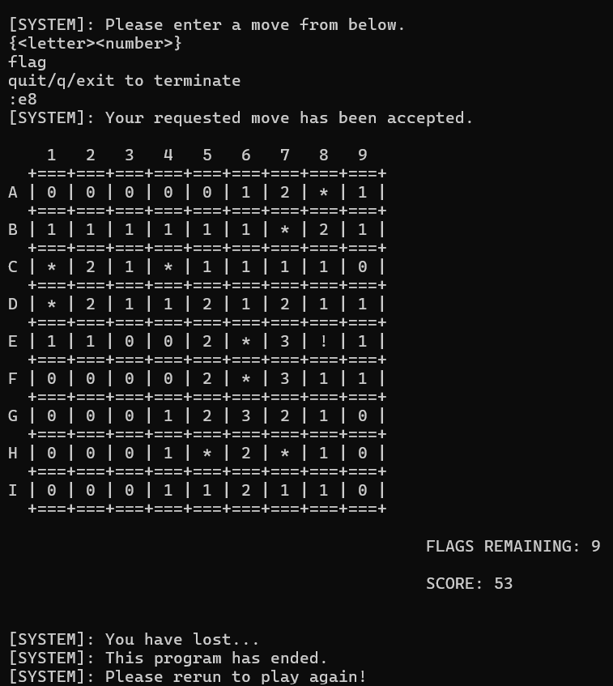

# minesweeper

## Overview
This is a classic Minesweeper game implemented for C++ playable inside a terminal. Refer to Minesweeper [here](https://en.wikipedia.org/wiki/Minesweeper_(video_game)).

## Screenshots




## Contents
This section goes over the contents in this directory.

First, navigate over to ```dir=src```.

- ```Makefile```: used to compile the files.
- ```game.cpp```: the main file to build the game.

## Setup
In this section, we are assuming that the user has some knowledge of C/C++ and has setup a working environment.

1. Download or copy the ```game.cpp``` file.

2. Place the files in your working directory.

3. Compile ```game.cpp``` and run the executiable file ```.o``` or ```.exe```.

Now, you can play Minesweeper!

## Controls
This section goes over the controls of the Minesweeper program. Refer to the
```Overview``` section to learn the rules of Minesweeper.

The following commands are to be executed inside the terminal.

Type: ```q```, ```quit```, or ```exit``` to quit the game.

Type: ```{<letter><number>}``` to enter a move (cell coordinates).

Type: ```flag``` to flag/unflag cells.

*You have to type and execute the command ```flag``` first, then the cell coordinates to flag/unflag properly.*

Rerun the program to play again!

## Notes
- Only easy difficulty is available at the moment (9x9, 10mines).
- "!" denotes that the user selected a mine cell to lose the game.

## Limitations
This section goes over features that still need to be developed.

- Medium and hard difficulty
- Restart system
- Multi-line command processing ```ex: flag a1```
- Chording
- Undo
- Timer
- Moves Tracker

## Tools
This section goes over the tool(s) used to make this program.

- WSL2 (Ubuntu 11.4.0)
- Vim w/coc.nvim and clang support for C++

## Sources
This section goes over external information used to make this program.

- Traversing through neighbors [Link](https://stackoverflow.com/questions/56485717/need-algorithmic-help-in-minesweeper-regarding-revealing-adjacent-tiles)
